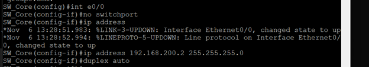
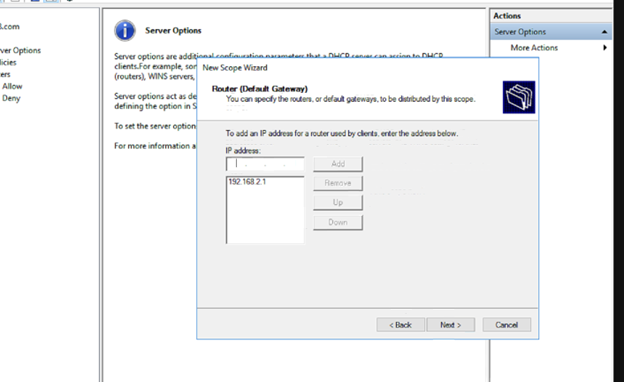
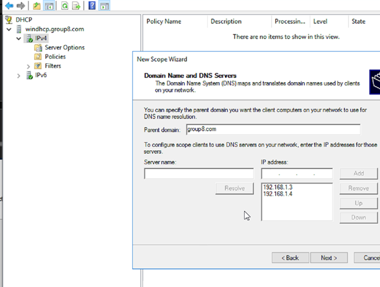

# Thiết kế hệ thống mạng cho doanh nghiệp

## Khảo sát hiện trạng  
Công ty có hợp đồng triển khai mạng cho Viện Giáo Dục Quốc Tế HUFLIT cụ thể như sau:  
+ Nhân sự: 400 sinh viên, 30 giảng viên, 20 nhân viên marketing và giáo vụ, 5 quản giáo cao cấp bao gồm giám đốc chương trình và quản lí đào tạo, 3 nhân viên quản trị mạng.
+ Thiết bị: 60 máy tính cho phòng Lab, 35 máy tính cho nhân viên, 3 máy in, 3 Server.
+ Tòa nhà: gồm 3 tầng, máy tính và máy in đặt tầng trệt, ngoại trừ phòng thực hành IT: 1 phòng ở tầng 1, 1 phòng khác tầng 2 và tầng 3
+ Thiết bị mạng: 5 Switch Layer 2, 1 Switch Layer 3, 1 Firewall Fortinet, 3 Access Point.

## Sơ đồ hệ thống
### Sơ đồ logic
  
### Sơ đồ vật lý  
  
## Bảng phân hoạch IP
### 🗂️ Thông tin mạng theo tầng và phòng

| Tầng  | Tên phòng   | Số lượng máy | Dãy IP        | Subnet Mask       | Gateway        | VLAN |
|-------|-------------|--------------|---------------|--------------------|----------------|------|
| Trệt  | Server      | 3            | 192.168.1.0    | 255.255.255.248    | 192.168.1.1    | 2    |
|       | Giảng viên  | 30           | 192.168.2.0    | 255.255.255.224    | 192.168.2.1    | 3    |
|       | Marketing   | 20           | 192.168.3.0    | 255.255.255.224    | 192.168.3.1    | 4    |
|       | Quản lí     | 5            | 192.168.4.0    | 255.255.255.248    | 192.168.4.1    | 5    |
| 1     | Lab         | 20           | 192.168.5.0    | 255.255.255.192    | 192.168.5.1    | 6    |
| 2     | Lab         | 20           | 192.168.5.0    | 255.255.255.192    | 192.168.5.1    | 6    |
| 3     | Lab         | 20           | 192.168.5.0    | 255.255.255.192    | 192.168.5.1    | 6    |  
  
Mạng nối giữa Switch và Firewall: 192.168.200.0/24  
Mạng nối giữa Firewall và Router: 192.168.190.0/24  
  
## Cấu hình các dịch vụ
### Cấu hình DHCP
Switch Layer 3  
Vai trò quan trọng trong việc điều tiết hệ thống mạng nội bộ.  
Sử dụng VTP (VLAN Trunking Protocol cho phép các VLAN được Trunk qua các Switch Layer 2 nhờ vào các port tương ứng)  
  
  
Cổng E0/0 nối với Firewall  
  
  
Các cổng từ E0/1-3 và E1/0-1 cấu hình trunking các VLAN sang Switch Layer 2  
  
  
  
Cấu hình các VLAN (các VLAN sẽ được cấp DHCP nhờ vào địa chỉ 192.168.1.2 – địa chỉ của DHCP Server)  
  
  
IP Routing  
  
  
Switch Layer 2  
Các Switch Layer 2 được tiến hành cấu hình tương tự nhau để gán các port access vào từng VLAN tương ứng.  
Nhận các VLAN từ Switch Layer 3 dựa vào VTP  
  
  
  
  
  
  
Cổng nối với Switch Layer 3 sẽ là mode trunking để nhiều VLAN có thể đi qua  
  
  
  
  
  
  
Các cổng nối với End-Device sẽ là mode access và access vào từng VLAN tương ứng.  
  
  
  
  
  
  
Cấu hình trên Server DHCP  
*Không tạo scope cho VLAN 2  
Nhập tên scope  
  
Nhập dãy IP sẽ cấp phát  
  
Nhập dãy IP không cấp phát, ngoại trừ  
  
Nhập thời gian được sử dụng IP  
  
Nhập vào Gateway  
  
Nhập DNS  
  
Chọn Yes, sau đó bấm Next để kích hoạt scope  
  
Làm với các scope tương tự  
  
  
### Cấu hình Routing
E0/0 sử dụng IP DHCP do ISP cấp  
  
  
E0/1 nối với mạng nội bộ  
  
  
NAT theo port  
  
  
ACL  
  
  
IP Routing  
  

    
### Cấu hình Firewall
Cấu hình Fortinet bằng CLI  
Cấu hình các port 1-router, port2-switch  
  
  
Policy cho phép mạng nội bộ ra Internet  
  
  
Routing mạng nội bộ  
  
  
Chia Vlan thanh cong va cac may ping ra duoc intenet  
  
  
  
### File Store
Tạo ổ đĩa trên windata  
  
  
Chuyển sang server sẽ được nhận SANS  
  
  
Vào iSCSI Initiator nhập IP của Server chia sẻ  
  
  
Format ổ đĩa và sử dụng  
  
  
  
### Backup dữ liệu
Sử dụng dịch vụ Windows Server Backup  
Chọn kiểu tiến hành  
  
  
Thêm thư mục cần backup  
  
  
Lưu ý nên lưu bản backup trên một ổ đĩa mạng hay một nơi nào đó không thuộc SRV-DC vì dữ liệu và bản backup nếu nằm cùng một máy và nếu máy đó bị hỏng thì việc backup trở nên vô nghĩa.  
Ở đây ta đã được chia sẻ một ổ đĩa iSCSI từ SV_store nên đây sẽ là nơi thích hợp để lưu trữ bản backup.  
  
  
Backup thành công  
  

### Cấu hình chính sách bảo mật
Tạo chính sách bảo mật cho OU  
  
  
Đặt tên cho chính sách  
  
  
Ngăn chặn nhân viên mở Registry  
  
  
Ngăn chặn nhân viên mở cmd  
  
  
Cập nhật các policy  
  
  
Kiểm tra trên user IT
  
  
